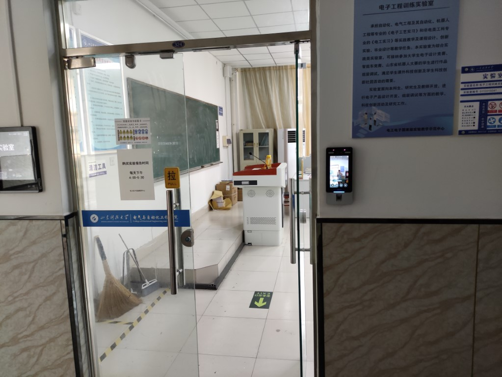
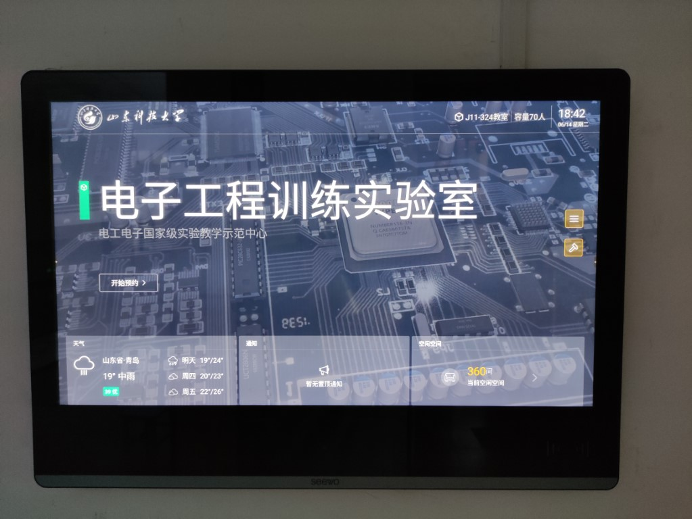

# J11-324 

## 特征

- 昼夜不分

- 有监管

- 不宜居住

## 描述

J11-324 实验室名为电子工程训练实验室，属于电气与自动化工程学院，目测面积约 200 平方米。该实验室常用于开展电子工艺实习等类似课程和课程设计，并在无课程安排时向学生开放，提供工位以方便学生参加学科竞赛、科技创新等活动。该学院的学生社团中，电子电路社、自动控制协会常选择此实验室开展社团活动。实验室内存放了一些实验报告，供学生按需购买。

实验室一面有窗，且窗户朝向为向北，并配有窗帘。实验室内有空调 2 台，截止到 2022 年 6 月，空调均能正常使用。受到用电控制系统的影响，该空调可能会在每日 22 时自动关闭，需再次手动启动才能继续使用。


*J11-324 内景。*

实验室采用人脸识别、指纹和智能卡混合门禁系统，并使用电磁锁、地锁以及圈锁锁定实验室门，您可在进入实验室前从门右侧通过人脸识别认证以解除电磁锁锁定，或联系其他实验室人员或管理人员以开门。对应地，在实验室内，您可以按下前门左侧的开关来解锁前门的电磁锁。


*从 J11-324 实验室外拍摄的前门。*

实验室外安装有一台基于 Android 5.0 以上操作系统的电子展板，该展板通常无人使用，仅用于显示实验室信息。



在 J11-324 实验室，您的自然时间观念将变得极不可靠。在该实验室的环境中，计时装置大多都是可靠的，您应该在您的视线范围内放置一台时钟或其它能指示当前时间的装置，并每隔一段时间从装置上获得当前时间。否则，您会因为无法感受环境变化而错误地判断时间，并有可能耽误您的工作。实验室内外皆无电铃或能够广播时间的装置，您也难以通过环境中的声音确定时间。

实验室内的电磁干扰较小，因此您的通讯、音视频录放装置均能够正常工作。您可以在实验室内拍摄照片或录像而不必担心装置损坏，但请您尽可能避开实验室内的其它人员以及其可能使用的激光器（如激光笔、激光雷达）以免受到实验室人员的排斥或损坏您摄像机的感光元件。

实验室受一名指定的教师严格监管，且实验室内配有协助管理员一名。该实验室的右前方角落里有一台网络闭路电视摄像机，管理实验室的教师可通过该摄像机的回放录像获知实验室近数天的情况。每一位合法使用实验室的人员均需要通过申请流程获得实验室工位并在门禁系统录入人脸识别信息。

*此处放置申请流程图。*

由于实验室受监管，您不能在实验室内用餐或住宿。食用少量的食物和短暂休息是允许的。实验室内没有食物和饮用水来源，您需要在实验室外寻找，最好在实验室内准备一些。

实验室内有可靠的网络设备，且具备 Internet 连接。您可以使用下列信息连接到该实验室的 Wi-Fi 接入点：

```
SSID    T*********4
PSK     ********
```

异步时空研究所的 *caibaojie* 等研究员已经确定此实验室安全，您可以在实验室开放期间随时申请使用。

## 行动路径

在 J11 三楼的北走廊可找到 J11-324 的出、入口。J11-324 共有两个出、入口，其中后门常年禁止使用，只能从前门进入或离开。在白天的大多数时间，实验室的前门会保持打开，您可以直接进入。由于门禁系统的密码未知，您无法自行录入人脸识别信息，更不能通过门禁系统改变锁状态。

## 相关团体和组织

加入该实验室后，可选择进入该实验室的通知群组，接收来自管理人员的通知信息。

## 事件记录

*caibaojie* 等至少三位研究员曾到访过此实验室，其中 *caibaojie* 在此停留过大约 2 个月，后因实验室内有课程安排离开此实验室。
